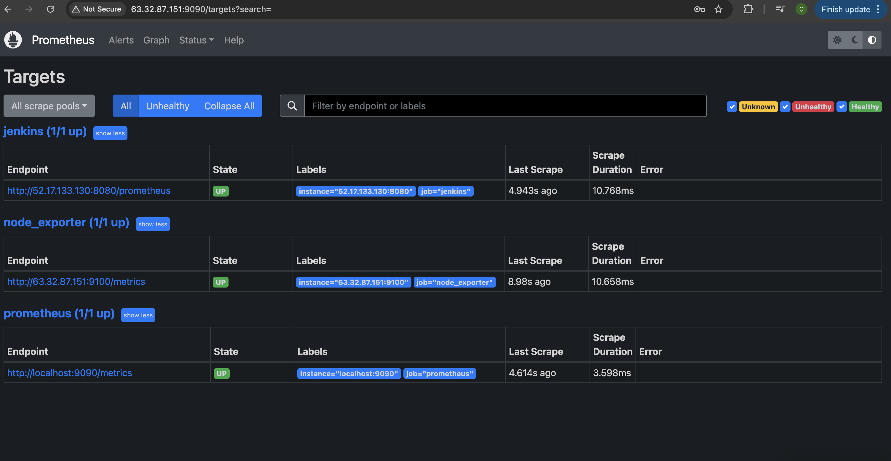
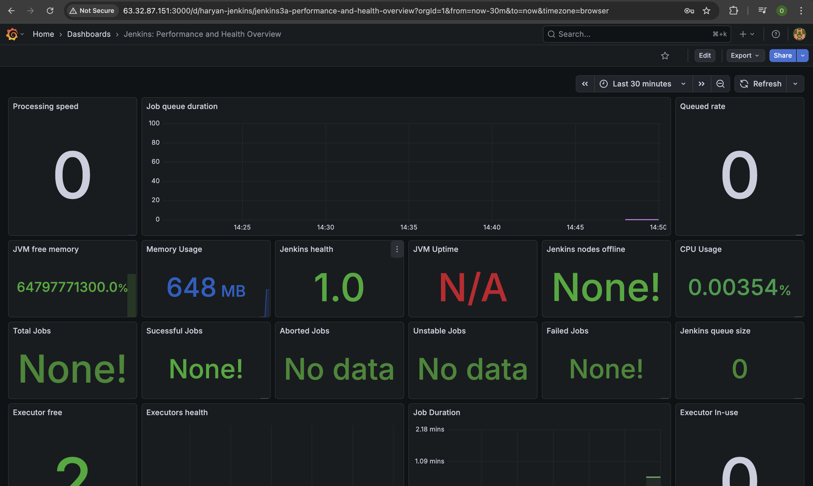
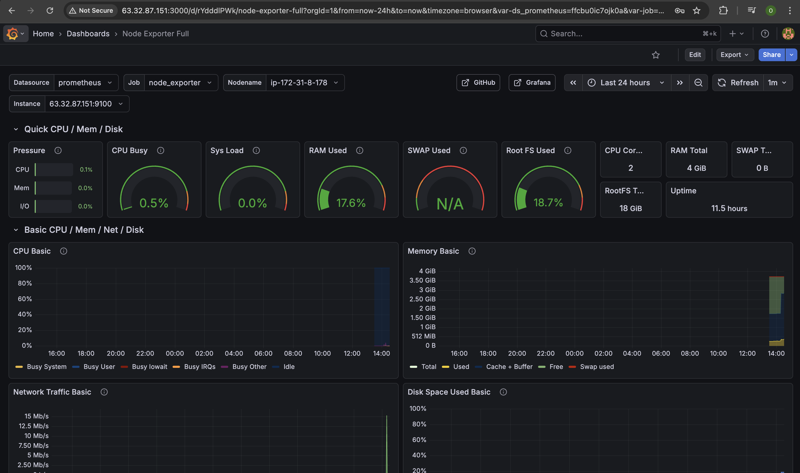

<div align="center">
  

  <br>
  <a href="http://netflix-clone-with-tmdb-using-react-mui.vercel.app/">
    
  </a>
</div>


# Netflix Clone DevSecOps Automation

A comprehensive DevSecOps implementation for deploying a Netflix Clone application using Jenkins, Docker, and Kubernetes, featuring automated security scanning and monitoring.

## 🎯 Project Overview

This project demonstrates a production-ready DevSecOps pipeline that automates the deployment of a React-based Netflix Clone application. It integrates best-in-class tools for CI/CD (Jenkins), Containerization (Docker), Orchestration (Kubernetes), and Security (SonarQube, Trivy, OWASP). The solution ensures code quality, security compliance, and reliable deployment to both Docker containers and Kubernetes clusters.

## 🚀 Why DevSecOps?

### Problems This Project Solves

* **Manual Deployments**: Eliminates error-prone manual build and deployment steps.
* **Security Vulnerabilities**: Proactively identifies security flaws in code and dependencies before deployment.
* **Inconsistent Environments**: Uses Docker to ensure consistency across development, testing, and production.
* **Lack of Visibility**: Provides real-time monitoring of application code quality and infrastructure health.
* **Scalability**: Leverages Kubernetes for orchestrating containerized applications.

### Key Features

* **Automated CI/CD**: Full automation from code commit to deployment.
* **Shift-Left Security**: Integrated SAST (SonarQube) and SCA (Trivy/OWASP) scans in the pipeline.
* **Container Orchestration**: Automated deployment to Kubernetes clusters.
* **Comprehensive Monitoring**: Prometheus and Grafana integration for infrastructure metrics.
* **Quality Gates**: Enforces code quality standards before deployment.

## 📁 Project Structure

```
├── .github/               # GitHub workflows (if applicable)
├── Kubernetes/            # Kubernetes Manifests
│   ├── deployment.yml     # Application Deployment definition
│   └── service.yml        # Service exposure definition
├── public/                # Static assets
├── src/                   # React Application Source Code
├── Dockerfile             # Container definition for the application
├── pipeline.txt           # Jenkins CI/CD Pipeline Script
├── vite.config.ts         # Vite Configuration
├── package.json           # Project dependencies
└── README.md              # Project Documentation
```

## 🔧 Issues Identified & Solutions Implemented

### 1. The "Docker Socket" Permission Wall
* **Challenge**: Jenkins couldn't talk to the Docker engine because `/var/run/docker.sock` is owned by `root`.
* **Solution**: Manually changed permissions (`chmod 666`) and added the `jenkins` user to the `docker` group to bridge the gap between the Jenkins service and the Docker daemon.

### 2. OWASP "Database Hunger"
* **Challenge**: OWASP Dependency-Check crashed while trying to download the massive NVD vulnerability database due to rate limits and API changes.
* **Solution**: Pivoted to using the `--noupdate` flag and implemented a shell script bypass (`|| true`) to ensure one failing scan didn't kill the entire deployment.

### 3. Docker Hub Authentication & Scopes
* **Challenge**: "Insufficient scopes" error despite correct credentials—the Access Token lacked "Write" permission.
* **Solution**: Generated a new Personal Access Token (PAT) with explicit Read/Write permissions and updated the Jenkins Credentials store.

### 4. Port Conflicts and Container Persistence
* **Challenge**: Deployments failed because the old container was still holding port `8081`.
* **Solution**: Added a cleanup command (`docker rm -f netflix-container || true`) at the start of the deployment stage to ensure a fresh "landing pad".

### 5. The "Ghost of Failure" (Jenkins Build Status)
* **Challenge**: Jenkins UI showed RED (Failure) even after successful deployment because of minor OWASP scan errors.
* **Solution**: Used Groovy logic and shell-level error handling to prioritize the actual deployment result over non-critical scan warnings.

### 6. Environment Consistency
* **Challenge**: Mismatch between tool names in code (e.g., `jdk17`) and Jenkins configuration.
* **Solution**: Standardized naming conventions in Jenkins "Global Tool Configuration" to match the pipeline script exactly.

## 🏗️ Architecture

The project employs a robust toolchain to deliver the application:

* **Source Control**: GitHub
* **CI/CD Server**: Jenkins (on EC2)
* **Application**: React (Node.js/Vite)
* **Containerization**: Docker
* **Orchestration**: Kubernetes
* **Security**:
    * **SAST**: SonarQube
    * **Container Scan**: Trivy
    * **Dependency Scan**: OWASP Dependency Check
* **Monitoring**: Prometheus & Grafana

## 🚀 Getting Started

### Prerequisites

* AWS Account
* DockerHub Account
* TMDB API Key
* GitHub Repository

### Setup Instructions

#### 1. Infrastructure Provisioning
* **EC2 Instance**: Launch an Ubuntu 22.04 server.
    * **Storage**: 25GB (to accommodate Docker images/logs).
    * **Elastic IP**: Attach an Elastic IP to ensure a static address.
* **Security Groups (Inbound Rules)**:
    * Port `8081`: Application (Netflix Clone)
    * Port `9000`: SonarQube
    * Port `8080` (or 81): Jenkins
    * Port `22`: SSH

#### 2. Server Configuration
SSH into your instance and set up the foundation:
```bash
# Update and Install Docker
sudo apt-get update
sudo apt-get install docker.io -y

# Configure Permissions
sudo usermod -aG docker $USER
sudo chmod 777 /var/run/docker.sock
```

#### 3. Jenkins & Tools Configuration
* **System**: Install Jenkins and Java (Eclipse Temurin).
* **Plugins**: Install the following:
    * Eclipse Temurin Installer
    * SonarQube Scanner
    * NodeJs Plugin
    * OWASP Dependency-Check
    * Docker / Docker Pipeline / Docker Build Step
* **Global Tool Configuration**:
    * **JDK**: Name it `jdk17`
    * **NodeJS**: Name it `node16`
    * **SonarQube Scanner**: Name it `sonar-scanner`
    * **Dependency-Check**: Name it `DP-Check`

#### 4. Security Integration
* **SonarQube**:
    * Run server: `docker run -d --name sonar -p 9000:9000 sonarqube:lts-community`
    * Generate Token: User > My Account > Security > Generate Token.
    * Add to Jenkins: Credentials > Secret Text > ID: `Sonar-token`.
* **Trivy**: Install on the server for container scanning.

#### 5. CI/CD Pipeline Setup
* Create a new "Pipeline" job in Jenkins.
* Copy the script from `pipeline.txt`.
* Add **DockerHub Credentials**: Username/Password (ID: `docker`).
* Add **Kubernetes Credentials** (if deploying to K8s): Kubeconfig (ID: `k8s`).

## 🔄 CI/CD Pipeline Rules

The pipeline is designed to be resilient and secure:
1.  **Clean**: Always starts with a clean workspace.
2.  **Scan**: Runs SonarQube and waits for Quality Gate (aborts if failed).

3.  **Check**: Scans dependencies (OWASP) and filesystem (Trivy).
4.  **Build**: Creates Docker image using the TMDB API Key.
5.  **Deploy**:
    *   Removes old container (`docker rm -f`).
    *   Launches new container on port `8081`.

## 📊 Monitoring

### Prometheus & Grafana Setup
1.  **Prometheus**: Configured to scrape Jenkins and Node Exporter metrics.

2.  **Grafana**: Visualizes the data.
    *   **Dashboard**: Import ID `1860` (Node Exporter Full) for complete system visibility.
     
     

